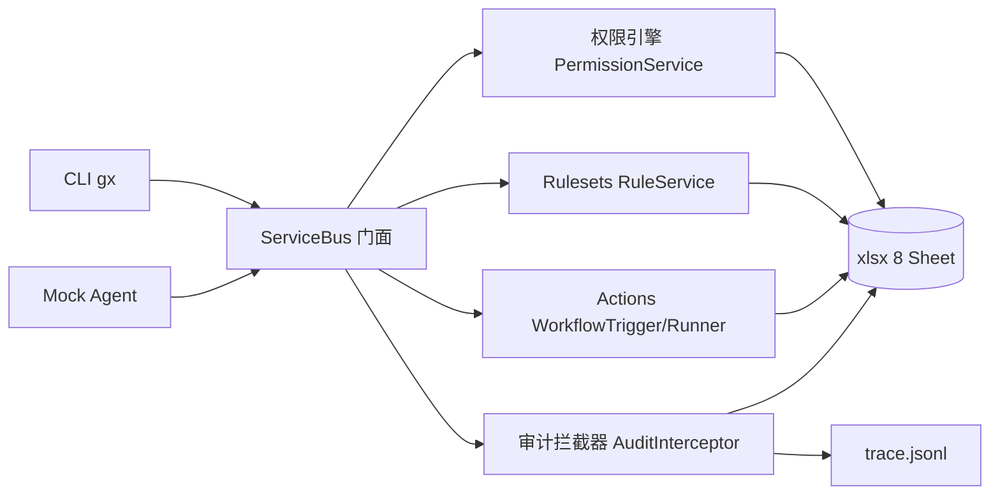

# GX-Sheet：基于电子表格模拟 GitHub 组织管控与自动化 Agent 原型

> GOSIM Create 2026 初赛作品（概念验证原型，非生产级产品）。

## 分支策略

- `main`：初赛冻结基线，存放正式提交物；只接收经过验证且不破坏 demo/trace 基线的变更。
- `codex/dev`：第二轮实验开发分支，用于 Agent、CI 与实验性功能；未完全验证，不直接合并 `main`。

## 项目定位

以普通 xlsx 电子表格为唯一持久数据源（Workbook = 组织，Sheet = 资源集，行 = 实体），
用 CLI + Mock Agent 作为交互入口，模拟 GitHub 组织管控与自动化 Agent 的核心语义。

## 架构



上层（CLI / Agent）只调用 `ServiceBus` 门面；权限、规则、工作流统一编排，
审计拦截器同时写 `audit_log`（哈希链）与 `trace.jsonl`。

## 初赛提交物

1. **源码仓库**：本仓库（Public）；
2. **生产轨迹**：`demo/output/trace.jsonl`（来自 OBS 录制 demo 那一次运行，禁止用测试/开发轨迹替代）；
3. **Demo 视频**：3-5 分钟完整链路演示。

提交前自检与录制规范见 [docs/plans/07-提交验收与提交物.md](docs/plans/07-提交验收与提交物.md)
与 [docs/plans/09-初赛代码优化与提交保护.md](docs/plans/09-初赛代码优化与提交保护.md)。

## 四大核心能力

| 能力 | 最小交付 |
| --- | --- |
| 组织权限 | `members` / `teams` / `roles` + 写前校验，readonly 用户写被拒 |
| Rulesets | `pull_requests` 模拟 PR，2 条规则（审批 ≥ 1、required-check） |
| 审计留痕 | `audit_log` 只追加 + 基础哈希链 |
| Actions | 最小步骤 runner（shell/python/http）-> `workflow_runs` |

### 已实现 / 决赛迭代

| 能力 | 本轮已实现（2026-09 评审优化第一轮） | 决赛迭代方向 |
| --- | --- | --- |
| 组织权限 | roles 矩阵 + P001 拦截 + 审计/trace | `roles` 表驱动权限、修复团队并集提权 |
| Rulesets | 规则表驱动：`RULESETS.status` 决定是否参与判定，支持 `gx ruleset enable/disable` | required-check 按 PR 精确关联 |
| PR 模拟 | create / approve / merge + R001 规则拦截 | 状态机与审批人身份校验 |
| Actions | shell/python/http 步骤 runner → `workflow_runs` | 沙箱化、按 PR 关联运行 |
| 审计/Trace | 哈希链 audit_log + 10 条事件 trace + `gx trace check/export` | trace 来源字段、滚动清理 |

## 环境要求

- Python 3.11-3.14

## 快速开始

```bash
# 1. 创建虚拟环境并安装依赖
python -m venv .venv
# Windows 激活：.venv\Scripts\activate
pip install -r requirements.txt
pip install -e .
# 2. 生成种子工作簿
python demo/init_seed.py
# 3. 体验 CLI
gx --help
```

## 一键演示

```bash
python demo/run_demo.py
# Windows 也可以双击 demo\run_demo.bat
```

脚本会自动跑通完整链路并生成 `demo/output/trace.jsonl`：
创建成员 -> 创建 PR -> 权限拦截（P001）-> Rulesets 拦截（R001）-> 审批 -> 运行工作流 -> 合并 PR -> 人工干预 -> 校验 trace。

`trace.jsonl` 每行一个 JSON 对象（8 个必填字段、5 种 type），示例：

```jsonl
{"timestamp": "2026-09-01T15:41:07.583344+00:00", "type": "prompt", "actor": "1", "action": "prompt", "resource": "", "detail": "添加成员 reader 为 readonly", "success": true, "error_msg": ""}
{"timestamp": "2026-09-01T15:41:07.583846+00:00", "type": "tool_call", "actor": "1", "action": "member_add", "resource": "workbook", "detail": {"name": "reader", "role": "readonly"}, "success": true, "error_msg": ""}
{"timestamp": "2026-09-01T15:41:07.618667+00:00", "type": "api_call", "actor": "1", "action": "member.add", "resource": "sheet:members", "detail": {"id": 3, "name": "reader", "role": "readonly"}, "success": true, "error_msg": ""}
```

## 使用 CLI 与 Mock Agent

```bash
gx member list
gx pr create --title "demo change"
gx workflow run ci-check
gx ruleset list
gx ruleset disable approval
gx ruleset enable approval
gx trace check
gx trace export demo/output/trace-backup.jsonl
python agent/mock_nl_parser.py "添加成员 bob 为 member"
```

## 已知局限（初赛原型）

> 本作品是概念验证原型，以下已知缺陷**刻意不修**——修复会改变 trace 事件，
> 导致已录制的演示视频与轨迹文件对不上。完整清单见
> [docs/dev/limitation.md](docs/dev/limitation.md)。

- 团队权限采用“并集”语义：与 admin 同队的 member 会继承 admin 权限（P001 判定过宽）；
- PR 审批未校验自审批与审批人身份，已合并 PR 可重复合并；
- `required-check` 取全局最新一条工作流运行记录，多 PR 间会串扰；
- 成员/团队允许重名；
- Mock Agent 为字符串匹配原型，非真实语义理解；
- shell/python 工作流步骤可执行任意命令，仅限本地演示。

## 决赛迭代方向

权限引擎改为 `roles` 表驱动、PR 状态机与审批校验、按 PR 关联运行记录、
存储并发与事务、trace 来源字段、Actions 沙箱化、接入真实 LLM Agent。
详见 [FUTURE.md](FUTURE.md) 与 [docs/dev/limitation.md](docs/dev/limitation.md)。

## 已确认决策

- 数据底座：本地 xlsx（不实现 Google Sheets）。
- 交付形态：CLI + Mock Agent（不实现 Streamlit WebUI）。
- GitHub 语义：最小 PR 模拟（不做真实分支/合并）。
- 代码仓库：`gosim-demo-26/`。

## 目录结构

```text
gosim-demo-26/
├── README.md
├── requirements.txt
├── constants.py
├── config.py
├── errors.py
├── FUTURE.md
├── .gitignore
├── docs/
│   ├── README.md
│   ├── specs/
│   ├── plans/
│   └── dev/
├── src/gx/
│   ├── __init__.py
│   ├── __main__.py
│   ├── storage/
│   ├── domain/
│   ├── services/
│   │   ├── perms/
│   │   ├── rules/
│   │   ├── audit/
│   │   └── actions/
│   ├── core/
│   └── api/
├── agent/
├── demo/
│   └── output/
├── tests/
│   ├── unit/
│   └── integration/
└── tools/
```

## 文档

- 项目计划：`docs/plans/`（先读 [docs/plans/00-README.md](docs/plans/00-README.md)）。
- 文档索引：[docs/README.md](docs/README.md)。
- 评审复现手册：[docs/demo_guide.md](docs/demo_guide.md)。
- 规格文档：[docs/specs/rulesets.md](docs/specs/rulesets.md)、
  [docs/specs/trace_format.md](docs/specs/trace_format.md)。
