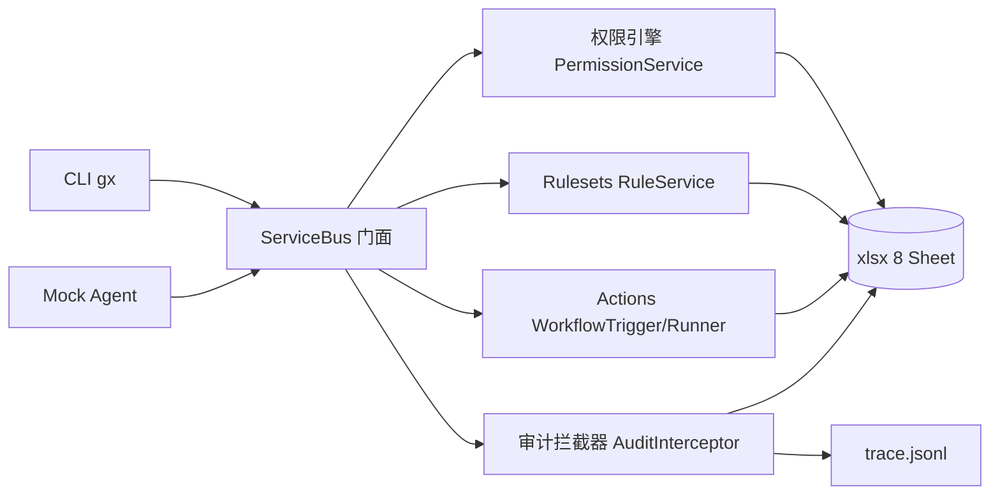

# 10 · 评审优化第一轮（Rulesets 表驱动 + CLI 补齐 + 文档/README 增强）

> 触发时机：初赛主体功能与正式 demo 链路已冻结（Phase5.5 完成），
> 在第一轮提交/录制前的评审优化。
> 目标：在不破坏「正式 demo 事件序列 = 10 条、trace schema、check_trace 规则」的前提下，
> 把仓库从「可演示」推向「可评审、可复现、配置可见」。
> 依据：豆包评审建议 + `09-初赛代码优化与提交保护.md` 红线 + `docs/dev/limitation.md`。

## 1. 背景与目标

评审建议的第一轮优化分五块，其中多数建议仓库已经实现（trace 自动埋点、
审计拦截器、CLI、PR 模拟、Actions 最小引擎、一键 demo、单元/集成测试）。
真正缺口是：

1. `rulesets` 表/模型/仓储已存在但**未参与规则引擎**，规则硬编码在
   `RuleService`（limitation.md #6，原计划决赛修）；
2. CLI 缺少 `ruleset` 与 `trace` 命令组；
3. 规格文档只有汇总式 `docs/specs/README.md`，缺独立 trace 格式文档与评审复现手册；
4. README 缺架构图、功能状态表、trace 示例。

本轮把这些缺口一次性补齐。

## 2. 红线（不可破坏）

| 红线 | 说明 |
|---|---|
| demo 事件序列不变 | `run_demo.py` 流程/顺序/`human_intervene` 一个不动；种子规则只是往 Sheet 写数据，默认 demo 不触发 ruleset 变更操作，**不得多出任何 trace 事件** |
| trace schema 不变 | 8 个必填字段、5 种 type 全部原样；ruleset 变更复用 `api_call`，**不新增 type** |
| `check_trace.py` 校验规则不变 | schema 校验与 `human_intervene` 强制校验保留 |
| 提交物基线隔离 | 测试一律使用临时目录；验证产生的 `trace.jsonl` / `seed-workbook.xlsx` 为测试数据，完成后 `git restore` 回正式基线 |
| 行为语义按表驱动 | `rulesets` 表成为规则唯一事实来源：行内 `status=active` 才参与判定，全部禁用 = 不拦截 |

## 3. 与既有文档的有意修订（写进本文件的原因）

`09-初赛代码优化与提交保护.md` 9.4 要求 `init_seed.py` 零改动。
本轮**有意修订该约束**，理由如下，后续实施必须同步更新相关文档：

- 修订对象是「新增种子规则行 + `RULESETS` 表新增 `status` 列」，不修改
  members/teams/workflows 等既有种子实体（成员 id、初始团队、初始工作流不变）；
- 种子数据只影响工作簿内容，不影响 trace 事件：demo 流程不会执行
  `ruleset enable/disable`，所以 trace 事件数量与顺序保持不变；
- 验收硬条件：`run_demo.py` 后 `check_trace` 输出仍为 **10 条事件**；
- limitation.md #6「规则硬编码，rulesets 表未参与判定」从已知局限移除，
  改为已实现能力；`09` 文档追加「本轮修订说明」小节说明此例外及重录条件。

## 4. 总体执行顺序

```text
第 0 步  纯文档：本文件 + 索引（docs/plans/00、docs/README.md）
第 1 步  工作流一：Rulesets 表驱动改造（先写测试，TDD）
第 2 步  工作流二：CLI 补齐（ruleset / trace 命令组，先写测试）
第 3 步  工作流三：规格文档（rulesets.md、trace_format.md、demo_guide.md）
第 4 步  工作流四：README 增强（Mermaid 架构图、功能状态表、trace 示例）
第 5 步  工作流五：测试覆盖补齐（单元 + 集成）
第 6 步  最终验证闭环 + 恢复基线 + 分批提交（文档一批、代码一批）
```

每步代码改动都先写失败测试再实现（TDD），最后统一跑 `pytest -q`。

## 5. 工作流一：Rulesets 表驱动 + 启用/禁用（核心业务）

### 5.1 数据模型与枚举

| 文件 | 改动 |
|---|---|
| `src/gx/domain/enums.py` | 新增 `RuleStatus` 枚举：`ACTIVE="active"` / `DISABLED="disabled"` |
| `src/gx/domain/models.py` | `RuleSet` 增加 `status: RuleStatus = RuleStatus.ACTIVE` 字段 |
| `demo/init_seed.py` | `RULESETS` 表头改为 `["id", "name", "rule_type", "status", "config"]`；`build_seed` 预置两条 active 规则 |
| `demo/init_seed.py` | 新增可复用函数 `seed_default_rules(storage)`：幂等写入两条规则，供 `build_seed` 与测试 fixture 调用 |

两条种子规则（id 与现有 `RuleViolation.rule_id` 对齐）：

| id | name | rule_type | status | config |
|---|---|---|---|---|
| `approval` | PR 合并需要至少 1 个审批人 | `approval` | `active` | `{}` |
| `required_check` | required-check 工作流需通过 | `required_check` | `active` | `{}` |

`RuleSet.id` 即 `rule_type` 值；`status` 放独立列而非 config JSON，评审打开
xlsx 即可见启用状态。`constants.SHEET_NAMES` 仍为 8 张表，只改 `RULESETS`
的列结构与内容，不改工作表数量。

### 5.2 规则引擎

`src/gx/services/rules/service.py`：

- `RuleService.__init__(self, ruleset_repo: RuleSetRepo | None = None)`：
  - `repo=None`：保持内置默认两条规则（兼容现有直接构造引擎的单元测试）；
  - `repo` 提供：读取 `status=active` 的行作为启用规则；**启用列表为空 = 全部规则关闭，不拦截**。
- `evaluate` 判定语义与现在完全一致：
  - `approval` 启用且 `pr.approvers` 为空 → 违规 R001；
  - `required_check` 启用且 `workflow_status` 非 success → 违规 R001；
  - 违规 `rule_id` 仍输出 `approval` / `required_check`，错误码不变。
- 未启用的行直接跳过，不产生违规。

### 5.3 ServiceBus 门面

`src/gx/core/service_bus.py`：

- 构造时创建 `RuleSetRepo(storage)`，并 `self.rules = RuleService(rule_repo)`；
- 新增只读方法 `list_rulesets()`（对齐 `list_workflows`，无需权限）；
- 新增变更方法：

```python
@require_permission(Action.WRITE, "sheet", resource_id=RULESETS)
def ruleset_set_enabled(self, subject_id: int, rule_id: str, enabled: bool) -> RuleSet
```

行为约定：

1. `rulesets` 属特殊表（`_ADMIN_ONLY_SHEETS`），普通成员/readonly 调用直接
   P001，且由现有 `enforce()` 自动写 `permission.deny` 审计与 trace；
2. 目标状态与当前状态相同 → 幂等返回，不写审计/trace；
3. 状态变化 → `repo.update` 后经 `interceptor.record` 留痕：

| 审计/事件字段 | 值 |
|---|---|
| `action_type` | `ruleset.update` |
| `resource_type` | `rulesets` |
| `resource_id` | 规则 id（`approval` / `required_check`） |
| `before_snapshot` / `after_snapshot` | `{"status": "active"|"disabled"}` |
| trace `type` | `api_call`（**不新增 type**） |
| `source` | `Source.API` |

### 5.4 权限拒绝测试（豆包明确要求）

新增单元测试必须断言普通角色（member / readonly）执行
`ruleset_set_enabled`：

- 抛出 `GXError` 且 code=`P001`；
- `audit_log` 出现 `permission.deny` 记录（`success=False`）；
- trace 文件新增一条 `type=api_call`、`action=permission.deny`、`success=false` 的行；
- 规则状态未被修改。

## 6. 工作流二：CLI 补齐

### 6.1 `gx ruleset` 命令组

`src/gx/api/cli.py` 新增 `ruleset_app` 并注册到 `cli`：

| 命令 | 行为 |
|---|---|
| `gx ruleset list` | 表头 `ID 类型 状态 名称`，逐行列出（对齐 member list 风格） |
| `gx ruleset enable <rule_id>` | 调 `ruleset_set_enabled(..., True)`，成功输出绿色 `[OK]` |
| `gx ruleset disable <rule_id>` | 调 `ruleset_set_enabled(..., False)` |

错误沿用 `_run_command`：P001 红色、S004 缺规则、参数错误统一 `typer.Exit(1)`。

### 6.2 `gx trace` 命令组

新增 `trace_app` 并注册：

| 命令 | 行为 |
|---|---|
| `gx trace check [path]` | 默认 `config.TRACE_OUTPUT_PATH`；调用 `tools.check_trace.check_trace`；有错逐行红色输出并 exit 1，通过输出 `[OK] … 共 N 条事件` |
| `gx trace export <dest>` | `--source` 默认 `TRACE_OUTPUT_PATH`；源==目标（abspath 比较）报错；源不存在报 `S001`；先校验源，通过后复制到 dest 再校验 dest；IO 失败报 `S005` |

实现要点：

- 只复用 `check_trace` 的校验函数，`tools/check_trace.py` 的 schema 校验规则一行不改；
- export 只是复制 + 校验，不修改默认 trace，不新增 trace 事件；
- 命令输出走现有颜色/错误码约定。

## 7. 工作流三：规格与复现文档

| 文件 | 内容 |
|---|---|
| `docs/specs/rulesets.md`（新） | RuleSet 字段/status 语义、两条种子规则、评估算法、`gx ruleset` 命令与权限说明 |
| `docs/specs/trace_format.md`（新） | 8 字段说明、5 种 type、check_trace 规则、2-3 行真实示例（从已提交 trace 静态复制，不改文件） |
| `docs/specs/README.md` | 数据模型表 `rulesets` 行补 `status` 字段；规则小节补启用/禁用语义；拆出 trace 内容并链接两个新规格文件 |
| `docs/demo_guide.md`（新） | 评审分步复现：环境 → init_seed → `gx --help` → member/team/role/pr/workflow → `gx ruleset list/enable/disable` → `gx trace check/export` → run_demo → 预期 10 条事件 |
| `docs/README.md` | 计划表加 10 行；文档结构表补 demo_guide、新规格文件 |
| `docs/dev/limitation.md` | 移除 #6；新增「本轮已修订」小节记录第 3 节的有意修订 |
| `docs/plans/09-初赛代码优化与提交保护.md` | 9.4 下方追加「本轮修订说明」，引用 10 文档第 3 节 |

## 8. 工作流四：README 增强

在 `README.md` 现有结构上增量修改：

1. 「项目定位」后插入 Mermaid 架构图：



2. 功能状态表：在「四大核心能力」表格后加「已实现 / 决赛迭代」两栏明细，
   Rulesets 行标注「规则表驱动、支持启用/禁用」；
3. 「使用 CLI」示例补 `gx ruleset list`、`gx trace export out.jsonl`；
4. 「一键演示」后贴 2-3 行真实 trace 示例（静态文本，来自已提交的
   `demo/output/trace.jsonl`，复制不改原文件）。

## 9. 工作流五：测试计划

### 9.1 既有 fixture 改造（规则表驱动生效的前提）

凡通过 `ServiceBus` 走 PR 合并/规则判定的测试工作簿，必须预置两条 active 规则。
在以下文件的构造器中补一行 `seed_default_rules(storage)`：

- `tests/unit/test_service_bus.py`
- `tests/unit/test_cli.py`
- `tests/unit/test_mock_parser.py`
- `tests/integration/test_full_chain.py`
- `tests/integration/test_workflow.py`

`test_rules.py` 直接构造 `RuleService()`（repo=None），继续走内置默认，
无需改动即可保持通过。

### 9.2 新增单元测试

| 文件 | 用例 |
|---|---|
| `tests/unit/test_rules_config.py`（新） | 种子两条 active 规则下无审批合并 → R001；disable `approval` 后无审批可合并；disable `required_check` 后失败工作流不拦合并；enable 后恢复拦截；未知 rule_id → S004；空 active 列表 → 不拦截 |
| `tests/unit/test_rules_permission.py`（新） | readonly/member 调 `ruleset_set_enabled` → P001 + `permission.deny` 审计 + trace `api_call`；admin 操作成功 → `ruleset.update` 审计 + trace，哈希链完整 |
| `tests/unit/test_cli_ruleset.py`（新） | `ruleset list` 输出两条；enable/disable 成功与幂等；readonly 被 P001 拦截；缺规则 S004 |
| `tests/unit/test_cli_trace.py`（新） | `trace check` 通过/失败路径；`trace export` 复制内容一致、目标被校验、源==目标报错、源缺失 S001 |

### 9.3 新增集成测试

`tests/integration/test_ruleset_toggle.py`（新）：

1. admin disable `required_check` → 有失败工作流记录仍可合并成功；
2. admin disable `approval` → 无审批可合并；
3. 全程审计哈希链可验证，trace 通过 `check_trace`（补 `human_intervene` 后校验）；
4. 全程使用 `tmp_path` 工作簿与 trace，不触碰仓库基线。

### 9.4 隔离约定（豆包重点）

- 所有测试 fixture 已在 `tmp_path` 建工作簿、`tmp_path` 写 trace，本轮保持；
- 任何测试不得写入 `demo/output/trace.jsonl` 或 `demo/seed-workbook.xlsx`；
- 新增测试沿用 `monkeypatch` 指向临时 trace 的模式（参考 `test_cli.py` 的
  autouse fixture）。

## 10. 最终验证闭环（PowerShell，仓库根目录）

```powershell
# 1. 全量测试
.venv\Scripts\python.exe -m pytest -q
# 预期：全部通过（基线 85 + 新增用例）

# 2. 完整链路验证（会临时改写正式基线文件，第 4 步恢复）
.venv\Scripts\python.exe demo\init_seed.py
.venv\Scripts\python.exe demo\run_demo.py
.venv\Scripts\python.exe tools\check_trace.py
# 预期：run_demo 9 环节全部 OK；check_trace 输出 [OK]，事件数 = 10

# 3. 人工抽查
#  - git diff --stat 确认改动仅 src/ tests/ docs/ README.md
#  - 打开 trace 确认：没有 ruleset.update / 多余 api_call；10 条事件顺序不变

# 4. 恢复正式提交物基线
git restore --source=HEAD -- demo/output/trace.jsonl demo/seed-workbook.xlsx
git status   # 应只剩 src/ tests/ docs/ README.md 改动
```

验收判定：

- [ ] `pytest -q` 全绿；
- [ ] `check_trace` 输出事件数 = **10**，schema 全部通过；
- [ ] trace 中无 `ruleset.update` 或任何新增事件类型；
- [ ] readonly 执行 `ruleset disable` 时 P001 + 审计 + trace 三件齐全（单测覆盖）；
- [ ] `git restore` 后工作区无 trace/xlsx 脏改动；
- [ ] 按第 11 节的「文档/代码隔离、按切片分批提交」方式提交，提交序列与第 14 节一致。

## 11. 分批提交策略（文档/代码隔离，按切片提交）

与 `09` 的两阶段策略保持一致，本轮只提交代码与文档，**不提交**验证产生的
trace 与 xlsx（除非评审后决定重录并单独走阶段二）：

| 类型 | 文件范围 | 对应切片 |
|---|---|---|
| 文档类 | `docs/`、`README.md` | 计划与索引、切片 5、切片 6、切片 8 |
| 代码类 | `src/`、`tests/` | 切片 1、切片 2、切片 3、切片 4、切片 7 |

文档与代码不在同一提交中混放；每个切片独立提交、内容单一、语义可回溯。
具体提交序列见第 14 节。

若评审演示需要展示 ruleset/trace 新命令，录制后按 `09` 阶段二单独提交
`demo/output/trace.jsonl` 与 `demo/seed-workbook.xlsx`（独立 commit，注明来自
OBS 录制会话）。

## 12. 风险与回滚

| 风险 | 现象 | 应对 |
|---|---|---|
| 规则表驱动后老工作簿（无规则行）合并不再拦 R001 | 只影响未跑 init_seed 的工作簿 | 文档强调 init_seed 先行；所有测试 fixture 预置规则；种子 xlsx 在阶段二随录制更新 |
| 新增种子规则导致 trace 多事件 | 事件数 > 10 | 预期不发生：demo 不触发 ruleset 变更；若发生立即停止，`git diff` 定位并回退 |
| 测试误写仓库基线 | trace/xlsx 出现脏改动 | 9.4 隔离约定 + 验证后 `git restore` + `git status` 复查 |
| `RuleService(repo=None)` 与表驱动双语义混淆 | 评审误读 | 文档 5.2 明确：None 仅为兼容直接单测；ServiceBus 始终传 repo |
| 文档索引遗漏 | docs/plans/00 或 docs/README 表不全 | 第 0/3 步都带索引更新，验收时人工核对 |

## 13. 完成定义（DoD）

- [ ] `rulesets` 表驱动规则引擎上线，默认种子两条 active 规则；
- [ ] `gx ruleset list/enable/disable` 与 `gx trace check/export` 可用；
- [ ] readonly 越权被 P001 拦截且审计/trace 齐全；
- [ ] trace schema、type 枚举、demo 10 条事件全部不变；
- [ ] `docs/plans/10`、specs、demo_guide、README、索引、limitation、09 修订说明全部落地；
- [ ] `pytest -q` 全绿，验证闭环完成并恢复基线；
- [ ] 文档与代码按切片隔离提交，提交序列与第 14 节一致。

## 14. 实施状态（2026-09-03）

按"每次只落地小部分"的节奏分批落地并逐批提交：

| 提交 | 内容 |
|---|---|
| `1d54f07` | 文档：本计划 + 00/README 索引 |
| `b15e0b2` | 切片 1：`RuleSet.status` 字段 + 种子规则 |
| `96806f9` | 切片 2：规则引擎表驱动 + ServiceBus 启用/禁用 |
| `ff150d1` | 切片 3：`gx ruleset` 命令组 |
| `95a9274` | 切片 4：`gx trace check/export` + 校验单一事实源 |
| `e44a62b` | 切片 5：rulesets/trace_format/demo_guide 规格与复现文档 |
| `531471a` | 切片 6：README 架构图/功能状态/trace 示例 |
| `14c97d7` | 切片 7：Rulesets 启用/禁用集成测试 |

收尾验证：全量 `pytest` 116 通过；`run_demo.py` + `check_trace` 事件数保持
10 条；正式 `demo/output/trace.jsonl` 与 `demo/seed-workbook.xlsx` 已恢复基线。

说明：恢复基线后，仓库内 `demo/seed-workbook.xlsx` 仍是第一轮优化前
（`3776e14`）的旧表头 `RULESETS`（`id,name,rule_type,config`，0 行规则）；
需运行 `python demo/init_seed.py` 才会生成 `status` 列与两条 active 规则。
该 xlsx 与正式 trace 均按 09 阶段二在 OBS 录制后单独提交，本轮不提前覆盖。
